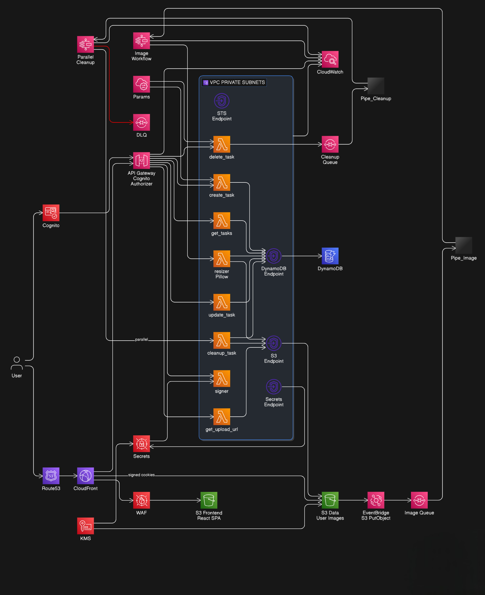
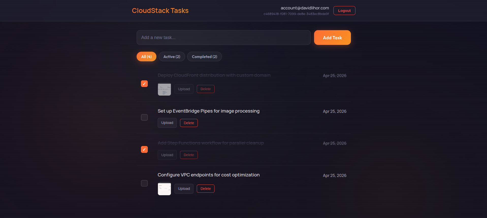
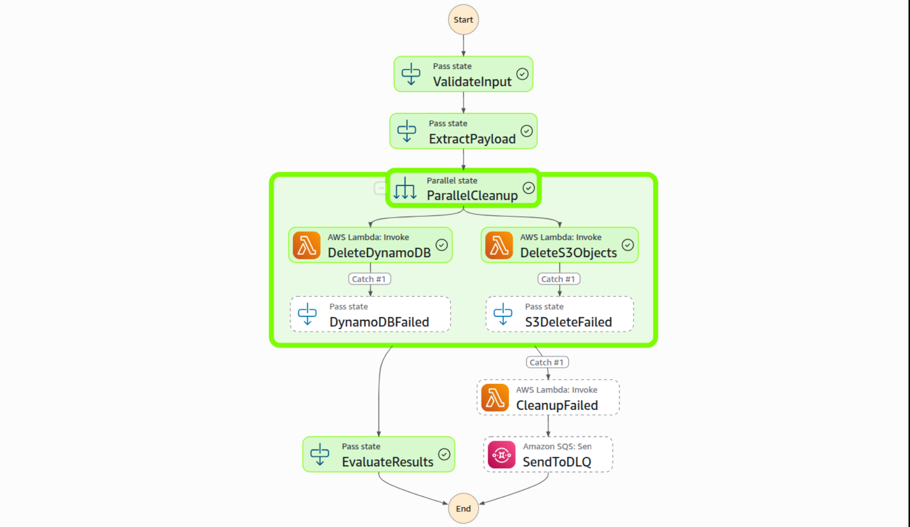
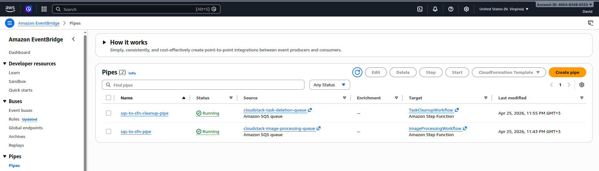
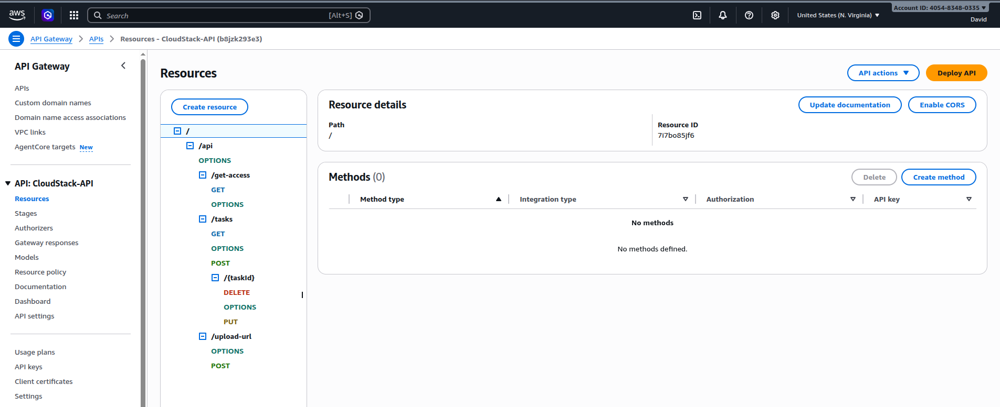
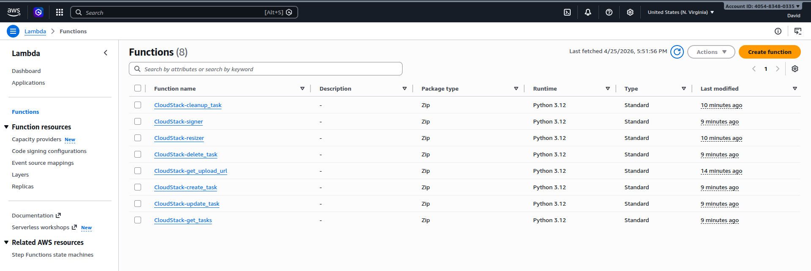
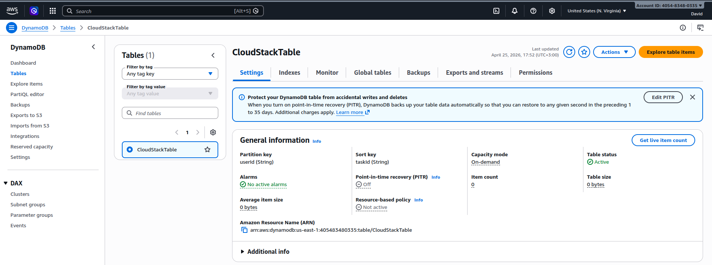
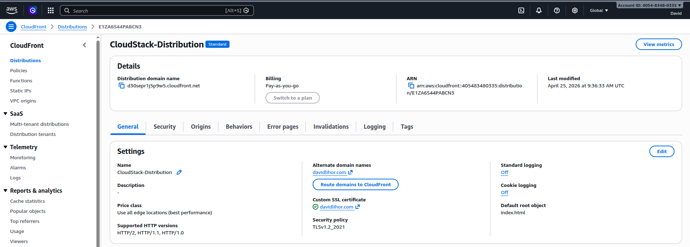
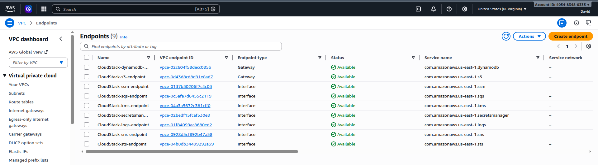
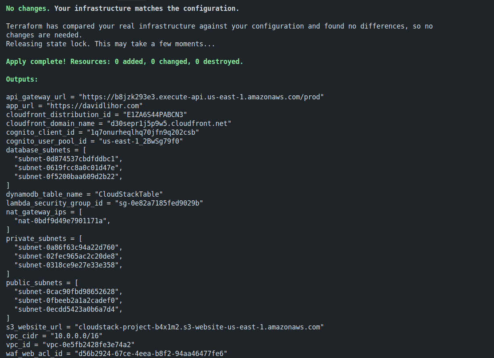

# CloudStack Task Manager

A production-grade serverless task management platform on AWS where authentication, event-driven image processing, and parallel resource cleanup are orchestrated through Terraform, demonstrating how modern organisations build secure, scalable applications without managing a single server.

## Overview

Most teams building serverless applications treat security and operational complexity as deployment-day concerns, leading to ad-hoc IAM policies, manual CloudFront configurations, and cleanup logic scattered across Lambda functions. This project takes a fundamentally different approach: every architectural decision — from WAF rules and KMS encryption to Step Functions orchestration and EventBridge Pipes — is codified in Terraform modules that mirror how platform engineering teams structure infrastructure at scale.

The application is a task manager with authenticated user accounts, full CRUD operations, and image attachment support. Users authenticate through Cognito, manage tasks stored in DynamoDB, and upload images to S3 which trigger automated thumbnail generation via EventBridge, SQS, and Step Functions. When tasks are deleted, a parallel cleanup workflow removes both the DynamoDB record and associated S3 objects simultaneously, with dead-letter queue handling for failed operations.

The React 19 frontend is served through CloudFront with WAF protection, custom domain support via Route53, and signed URLs for secure S3 access. Lambda functions run in private VPC subnets with VPC endpoints for AWS service communication, eliminating NAT Gateway data transfer costs. Infrastructure secrets live in Secrets Manager with a caching Lambda extension layer, IAM follows least-privilege with dedicated roles per function, and AWS Config continuously validates compliance against organizational policies.

## Architecture

Users access the application through a custom domain (or CloudFront distribution) protected by AWS WAF with rate limiting and managed rule sets. The React SPA communicates with API Gateway REST API secured by a Cognito authorizer, which proxies requests to seven Lambda functions — each handling a single operation (create, get, update, delete tasks, plus image upload URL generation, resizing, and cleanup).

When users upload images, the frontend obtains a pre-signed URL from the `get_upload_url` Lambda, uploads directly to S3, then an EventBridge rule detects the PutObject event and sends a message to the image processing SQS queue. An EventBridge Pipe automatically triggers a Step Functions workflow that invokes the `resizer` Lambda to generate thumbnails and update the DynamoDB hasImage flag.

Task deletion follows an event-driven pattern: the `delete_task` Lambda sends a message to the cleanup SQS queue, which triggers a Step Functions state machine via EventBridge Pipes. The state machine executes parallel branches — one deleting the DynamoDB item, one removing S3 objects — with independent error handling and dead-letter queue routing for failed cleanups.

All infrastructure runs in a custom VPC with private subnets for Lambda execution and VPC endpoints (DynamoDB, S3, Secrets Manager, STS) to keep AWS API traffic off the public internet. CloudFront uses Origin Access Control to restrict S3 bucket access, KMS encrypts sensitive data at rest, and CloudWatch logs every Lambda invocation with 30-day retention.

## Tech Stack

**Infrastructure**: AWS (CloudFront, S3, API Gateway, Lambda, DynamoDB, Cognito, VPC, EventBridge, SQS, Step Functions, EventBridge Pipes, WAF, KMS, Secrets Manager, Parameter Store, IAM, CloudWatch, Route53, ACM, AWS Config, AWS Backup), Terraform with multi-region providers and modular structure

**Backend**: Python 3.12 Lambda functions, Boto3 SDK, Pillow for image processing, AWS Parameters and Secrets Lambda Extension for caching

**Frontend**: React 19, TypeScript, Vite, React Router 7, TanStack Query (React Query), TailwindCSS 4, Amazon Cognito Identity SDK

**State Management**: Terraform S3 backend with DynamoDB locking, React Context API for file handling, TanStack Query for server state

**Security**: Cognito User Pools with email verification, AWS WAF with rate limiting and managed rules, KMS encryption for secrets and CloudFront signing keys, IAM least-privilege roles per Lambda, VPC endpoints for private AWS API access, CloudFront signed URLs for S3 objects

**Monitoring & Compliance**: CloudWatch Logs and Metrics, AWS Config rules, AWS Backup for DynamoDB point-in-time recovery, AWS Budgets with SNS email alerts

**CI/CD**: GitHub Actions workflows for frontend build/deploy and Terraform validation

## Key Decisions

- **Step Functions for parallel cleanup instead of sequential Lambda operations**: When users delete tasks with attached images, both the DynamoDB item and S3 objects must be removed. A Step Functions state machine executes these operations in parallel branches with independent error handling, ensuring partial failures don't silently leave orphaned resources. Failed cleanups route to a dead-letter queue rather than blocking the user-facing API response.

- **EventBridge Pipes between SQS and Step Functions rather than Lambda polling**: Traditional approaches use Lambda functions with SQS event source mappings to trigger workflows. EventBridge Pipes directly connect SQS queues to Step Functions, eliminating the intermediary Lambda invocation cost and latency while maintaining guaranteed delivery semantics and built-in error handling.

- **AWS Parameters and Secrets Lambda Extension over direct SDK calls**: Lambda functions retrieve the DynamoDB table name from Parameter Store and CloudFront signing keys from Secrets Manager on every invocation. The AWS extension layer caches these values in-memory with configurable TTLs (5 minutes), reducing API calls, improving cold start performance, and simplifying the Lambda function code to environment variable lookups.

- **VPC endpoints for AWS service traffic instead of NAT Gateway**: Lambda functions run in private subnets for security isolation but need access to DynamoDB, S3, Secrets Manager, and STS. VPC endpoints route this traffic through AWS's private network rather than the internet via NAT Gateway, eliminating data transfer charges (which scale with usage) and reducing latency for high-frequency operations like DynamoDB queries.

- **Dedicated IAM role per Lambda function rather than shared execution role**: Each of the seven Lambda functions has its own IAM role with policies scoped to only the actions and resources that specific function requires. For example, `delete_task` can write to SQS but not invoke Step Functions directly, while `resizer` can read/write S3 but has no DynamoDB delete permissions. This aligns with least-privilege principles and makes compliance audits trivial.

- **CloudFront signed URLs for S3 object access over S3 pre-signed URLs**: S3 pre-signed URLs expose the bucket's regional endpoint and bypass CloudFront caching and edge locations entirely. CloudFront signed URLs serve content through the CDN with encryption in transit, geographic distribution, and WAF protection, while still restricting access to authenticated users through time-limited signatures generated by the `signer` Lambda using a KMS-protected private key.

- **Terraform module structure mirroring infrastructure layers (network, security, storage, compute, frontend)**: The infrastructure is split into five Terraform modules with explicit dependencies passed through outputs (e.g., `module.network.private_subnet_ids` feeds `module.compute`). This mirrors how SRE teams structure shared infrastructure in multi-team organizations, makes blast radius smaller during changes, and allows independent testing of each layer.

- **Multi-region Terraform providers for CloudFront certificate requirements**: CloudFront distributions require ACM certificates to be provisioned in us-east-1 regardless of where the application runs. The Terraform configuration uses two AWS provider aliases (`aws` and `aws.virginia`) so the network module can create the certificate in the correct region while all other resources deploy to the primary region, avoiding cross-region dependencies and manual certificate management.

- **AWS Config and AWS Backup for compliance and disaster recovery**: AWS Config continuously monitors resource configurations (e.g., ensuring S3 buckets have encryption enabled, Lambda functions are in VPCs) and triggers SNS notifications for drift. AWS Backup handles DynamoDB point-in-time recovery backups on a scheduled basis, providing disaster recovery capabilities without managing snapshots manually or writing custom backup Lambda functions.

- **React Query for server state management over manual useEffect data fetching**: The frontend uses TanStack Query to manage all API interactions, task list state, and cache invalidation. This eliminates boilerplate loading/error state logic, provides automatic background refetching, optimistic updates, and request deduplication — keeping the React components focused on UI rendering rather than data synchronization concerns.

## Screenshots

**React Task Manager Frontend** — The live task management interface displaying an authenticated user's task list with real-time CRUD operations. Each task card shows title, completion status, and attached image thumbnails served through CloudFront. The interface includes task filtering, image upload with drag-and-drop support, and delete confirmation modals. The frontend is served via CloudFront with custom domain, WAF protection, and client-side routing powered by React Router 7.

**Step Functions Parallel Cleanup Workflow** — The Step Functions state machine execution graph displaying the parallel cleanup workflow triggered when users delete tasks. Two branches execute simultaneously — DeleteDynamoDB and DeleteS3Objects — each invoking the cleanup_task Lambda with different action parameters. The workflow includes error handling with Catch blocks that route failures to dedicated states before sending failed messages to the dead-letter queue via SQS integration, demonstrating event-driven orchestration without Lambda polling overhead.

**EventBridge Pipes SQS to Step Functions Integration** — AWS EventBridge Pipes console showing the two pipe configurations that connect SQS queues directly to Step Functions state machines without intermediary Lambda functions. The image processing pipe reads from `cloudstack-image-processing-queue` and triggers `ImageProcessingWorkflow`, while the cleanup pipe reads from `cloudstack-task-deletion-queue` and invokes `TaskCleanupWorkflow` — both using FIRE_AND_FORGET invocation to decouple queue consumption from workflow execution.

**API Gateway REST API with Cognito Authorizer** — AWS API Gateway interface displaying the serverless REST API with `/tasks` and `/upload-url` resources, each supporting multiple HTTP methods (GET, POST, PUT, DELETE) configured with Lambda proxy integration. The API uses a Cognito User Pool authorizer to validate JWT tokens from the frontend, ensuring only authenticated users can access task operations and generate pre-signed S3 upload URLs.

**Lambda Functions in VPC with Extension Layers** — AWS Lambda console listing all seven serverless functions deployed in private VPC subnets with security group restrictions. Each function includes the AWS Parameters and Secrets Lambda Extension layer for in-memory caching of SSM parameters and Secrets Manager values, reducing cold start latency and AWS API calls. The resizer function includes an additional Pillow layer for image processing and has reserved concurrency configured for production workloads.

**DynamoDB Table with On-Demand Billing** — AWS DynamoDB console showing the `CloudStack-tasks-dev` table configured with on-demand billing (PAY_PER_REQUEST) and composite primary key (userId as partition key, taskId as sort key). The table stores task metadata including title, completion status, timestamps, and hasImage flag updated by the image processing workflow. Point-in-time recovery is enabled through AWS Backup integration for disaster recovery scenarios.

**CloudFront Distribution with WAF and Custom Domain** — AWS CloudFront console showing the CDN distribution configuration with custom domain (via Route53 and ACM certificate), S3 origin with Origin Access Control, cache behaviors optimized for static assets, and WAF Web ACL attachment. The distribution provides HTTPS encryption, geographic edge caching, custom error responses for React Router client-side routing, and signed URL validation for authenticated image access.

**VPC Architecture with Private Subnets and VPC Endpoints** — AWS VPC console showing the custom VPC with public and private subnet configurations across multiple availability zones. Lambda functions execute in private subnets without internet access, using VPC endpoints (DynamoDB Gateway Endpoint, S3 Gateway Endpoint, Secrets Manager Interface Endpoint, STS Interface Endpoint) to communicate with AWS services over AWS's private network. This eliminates NAT Gateway data transfer costs and improves security posture by keeping AWS API traffic off the public internet.

**Terraform Modular Deployment Output** — Terminal output showing successful Terraform deployment with five modules (network, security, storage, compute, frontend) and key infrastructure outputs including CloudFront distribution URL, API Gateway endpoint, Cognito User Pool ID, VPC details, and S3 bucket names. Remote state is stored in S3 with DynamoDB locking to enable team collaboration and prevent concurrent modification conflicts.

## Author

**David**

- Website: [davidlihor.com](https://davidlihor.com)
- GitHub: [github.com/davidlihor](https://github.com/davidlihor)
- LinkedIn: [linkedin.com/in/david-lihor](https://www.linkedin.com/in/david-lihor)